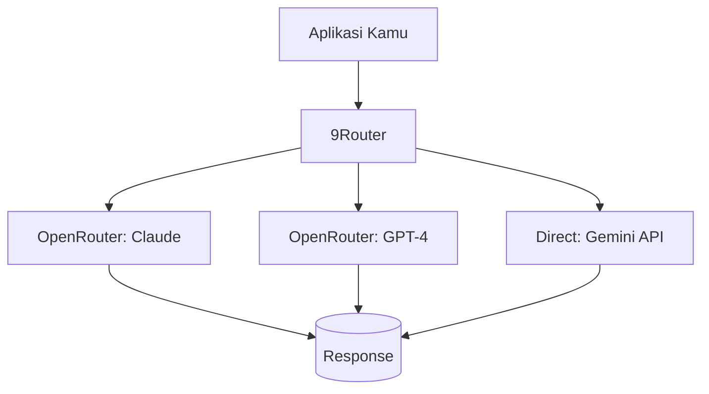

Di tengah maraknya AI, satu masalah besar muncul: terlalu banyak model, terlalu banyak API, terlalu banyak akun. 9Router dan OpenRouter datang sebagai solusi — satu titik akses untuk semua model AI.

## OpenRouter: The Universal API Gateway

OpenRouter adalah API gateway yang menyatukan puluhan model AI dari berbagai provider dalam satu endpoint.

### Kenapa OpenRouter?

**Satu API untuk Semua Model**

Dengan OpenRouter, kamu bisa panggil GPT-4, Claude, Gemini, Llama, Mistral, dan ratusan model lain cukup dengan ganti parameter `model` — tanpa perlu API key berbeda setiap provider.

```python
import requests

response = requests.post(
    "https://openrouter.ai/api/v1/chat/completions",
    headers={
        "Authorization": "Bearer YOUR_API_KEY",
        "Content-Type": "application/json"
    },
    json={
        "model": "anthropic/claude-3.5-sonnet",  # ganti model semaumu
        "messages": [{"role": "user", "content": "Halo!"}]
    }
)
print(response.json())
```

**Smart Routing & Fallback**

OpenRouter otomatis routing ke model terbaik berdasarkan:
- **Harga** — pilih termurah otomatis
- **Provider** — prioritasi provider tertentu
- **Provision** — fallback otomatis kalau model lagi down

**Provision (Providermanaged)** — redundant API keys dari provider sama, kalau satu rate-limited, langsung pindah key lain tanpa kamu notice.

### Provider Unggulan di OpenRouter

| Provider | Model Unggulan | Kelebihan |
|---|---|---|
| **Anthropic** | Claude 3.5 Sonnet, Opus | Reasoning terbaik, safety |
| **OpenAI** | GPT-4o, o1-mini | Multimodal, speed |
| **Google** | Gemini 1.5 Pro | Context window 2M token |
| **Meta** | Llama 3.1 405B | Open source, gratis tier |
| **Mistral** | Mixtral 8x22B | Efisien, multilingual |

## 9Router: The Missing Piece

Kalau OpenRouter adalah API gateway publik, **9Router** adalah *intelligent routing proxy* yang duduk di antara aplikasi kamu dan OpenRouter.

### Kenapa 9Router?

**Auto Model Fallback**

9Router otomatis coba model cadangan kalau model utama gagal atau kehabisan kuota:

```
Coba Claude 3.5 Sonnet → Rate limited → Auto fallback ke GPT-4o → Sukses
```

Semua terjadi otomatis, aplikasi kamu tidak perlu handling error.

**Cost Optimization**

9Router punya algoritma routing pintar:

- Request sederhana → model murah (Llama 3, Mistral)
- Request kompleks → model mahal (Claude, GPT-4)
- Hemat biaya hingga 60% tanpa kurangi kualitas

**Load Balancing**



9Router mendistribusikan request ke beberapa provider, hindari rate limiting, dan pastikan latency tetap rendah.

## Cara Mulai

### 1. Daftar OpenRouter

```bash
# 1. Buka https://openrouter.ai
# 2. Sign up dengan Google/GitHub
# 3. Top up saldo (minimal $5)
# 4. Copy API key dari dashboard
```

### 2. Test dengan cURL

```bash
curl -X POST https://openrouter.ai/api/v1/chat/completions \
  -H "Authorization: Bearer $OPENROUTER_API_KEY" \
  -H "Content-Type: application/json" \
  -d '{
    "model": "openai/gpt-4o-mini",
    "messages": [{"role": "user", "content": "Halo!"}]
  }'
```

### 3. Integrasi ke Project

```typescript
// Contoh integrasi dengan TypeScript
const OPENROUTER_URL = 'https://openrouter.ai/api/v1/chat/completions'

async function chat(pesan: string, model = 'openai/gpt-4o-mini') {
  const res = await fetch(OPENROUTER_URL, {
    method: 'POST',
    headers: {
      Authorization: `Bearer ${process.env.OPENROUTER_KEY}`,
      'Content-Type': 'application/json',
    },
    body: JSON.stringify({
      model,
      messages: [{ role: 'user', content: pesan }],
    }),
  })
  return res.json()
}
```

## Tips & Trik

### Pilih Model Berdasarkan Kebutuhan

| Kebutuhan | Model | Harga per 1M token |
|---|---|---|
| Chat sederhana | GPT-4o-mini | $0.15 |
| Coding | Claude 3.5 Sonnet | $3.00 |
| Analisis data | Gemini 1.5 Pro | $1.25 |
| Open source | Llama 3 70B | $0.59 |
| Multimodal | GPT-4o | $2.50 |

### Provider Fallback Strategy

Recommended provider order buat production:

1. **Anthropic** — kualitas terbaik
2. **OpenAI** — fallback utama
3. **Google** — fallback kalau dua di atas down

### Hemat Budget

```
Request: "Tulis puisi tentang coding"
GPT-4 → $0.05
Dengan 9Router → otomatis dipakai Llama 3 8B → $0.001
Hemat: 98%
```

## Kesimpulan

OpenRouter dan 9Router mengubah cara developer mengakses AI:

- **OpenRouter** — satu API key untuk ratusan model
- **9Router** — routing cerdas dengan fallback otomatis
- **Keduanya** — hemat waktu, uang, dan sakit kepala

Dengan dua tools ini, kamu bisa build aplikasi AI yang resilient, optimal biaya, dan gak terikat satu provider.

Selamat ngoding AI! 🚀